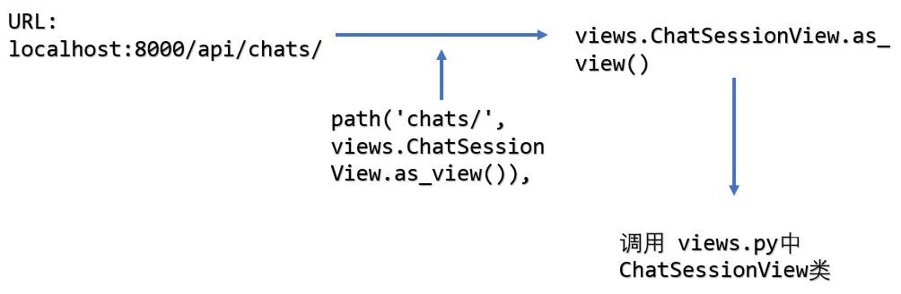

# 项目细节解释
## Outline
* 本项目整体上大部分基于[教程](https://danidee10.github.io/2018/01/01/realtime-django-1.html)。
我进行添加的部分主要是数据处理的模块（`chat` 目录下的两个文件 `geneRes.py` 和 `data.py`）。在最外层看整个项目的框架如下：
```
mychat
|
|> chat\    Django APP
|> Doc\     文档
|> ENV\     虚拟环境
|> hubot\   hubot（是独立于本工程的，部署的时候没有提及，我是先基于hubot在ubuntu上实现了与Django的交互，但是他项目本身是用javascript写成的，其异步性的特点并不适用于计算频繁的场合。所以之后就直接在Django框架中加数据处理的部分了。可以查阅资料用它进行一些实验）
|> mychat\  Django 框架组成部分，包含最基本的设置以及url等信息
|> mychat-frontend Vue.js实现的前端
|> preProc\ 我写的处理文档的源文件，对于本工程只需要用到其中的 storeDB.py
|> manage.py Django 框架组成部分
```
* 整个工程上手在于对 `Django` 框架的熟悉，建议完成 `Django`  最基本的教程 [basic poll application](https://docs.djangoproject.com/en/2.1/intro/tutorial01/)
* 大致熟悉一下前端最基本的 `HTML`,`CSS`,`JavaScript`，然后稍微了解一下 `Vue.js` 的基本特性，就可以开始分析源码了。
## 细节解释
### 前端
* 核心在于 `mychat-frontend\src\components\` 中的两个文件：
    * `UserAuth.vue` 实现用户登录注册的界面
    * `Chat.vue` 实现聊天界面
* `UserAuth.vue` 中主要是两个函数
    * `signUp` 中将输入的邮箱、用户名、密码 `post` 到 `http://localhost:8000/auth/users/create/` 来创建一个新的用户，随后自动调用 `signIn` 函数来完成登录。
    * `signIn` 中将用户名、密码 `post` 到 `http://localhost:8000/auth/token/create/` 中取得一个 `Token` 用来完成用户认证，然后添加 `router` 信息 `/chats` ，这个 `url` 会引发 `Django` 服务器的一些反应，进入 `chats` 模块。
* `Chat.vue` 中要注意的是一下这几个函数：
    * `created` 该函数在每次页面刷新时调用，如果刷新后发现`this.$route.params.uri` 存在，则进入 `joinChatSession` 函数。注意最后的 `setInterval(this.fetchChatSessionHistory, 500)` 意思是每隔500毫秒会拉取一下历史消息。这里详细见本文档随后的 `WebSocket` 解释
    * `startChatSession` 该函数向 `Django` 发出 `post` 请求，后端会自动创建一个聊天室，该聊天室有对应的 `uri` 
    * `postMessage` 该函数向相应的聊天室发送消息。
    * `joinChatSession` 用于另外一个用户加入现有的聊天室
    * `fetchChatSessionHistory` 拉取历史消息。
    * `connectToWebSocket` 由于 `uWSGI` 无法使用，所以这部分在项目中也是无效的。
### 后端
流程如图：
* 后端要注意两个文件夹：`mychat\` 和 `chat\`
* `mychat\` 是 `Django` 项目中最基本的部分，注意一下两个文件：
    * `settings.py` 包含了各种设置信息，重点可以关注数据库的设置操作。
    * `urls.py` 包含了服务器最基本的 `url`，比如其中的 `admin/` 等。
* `chat\` 是用 `Django` 生成的一个 `app`，重点关注 `views.py`
    * 在 `views.py` 中的函数调用是由 `urls.py` 决定的。根据请求类型再执行相应的函数。
    * 注意在 `ChatSessionMessageView` 类中的函数 `post`。这个函数在每次前端点击发送时调用，主要功能是将消息进行存储，在返回响应之前我添加了如下代码来调用自动回复模块。意思是只处理费 `hubot` 用户发的消息，并且只要在消息前缀是 `/` 时才进行自动回复（这个地方也可以根据需要自己更改）。而 `geneResponse` 函数就依赖于之前所实现的数据处理模块了（`geneRes.py`和`data.py`）详细情况见他们各自文件头的注释。
```
if str(user) != 'hubot' and message[0] == '/':
    print('preparing generate response...')
    geneRes.geneResponse(message, uri)
```

### 关于WSGI
这里详细地说明一下没有装上的那一模块所起的主要作用以及项目现状。
* 整体框架由于没有 `uWSGI`，所以 `RabbitMQ` 那一块也是不起作用的。现在的效果大概就是客户端定时地执行 `fetchChatSessionHistory` 操作来取得更新的信息，实质上就是一种轮询。形象点大致如下：
    * 客户端：（每隔一段时间）(#`O′)有没有消息
    * 服务器端：没有。
    * 客户端：（每隔一段时间）(#`O′)有没有消息
    * 服务器端：没有。  
    * 客户端：（每隔一段时间）(#`O′)有没有消息
    * 服务器端：你好烦nei，给你说过了，没有。
    * 客户端：（每隔一段时间）(#`O′)有没有消息
    * 服务器端：好啦好啦，有了，给你给你。
* 很明显轮询是很浪费资源的，明明没有新的消息却还要占用带宽来进行查询操作。而 `WebSocket` 在于它是一种全双工协议，通信可以由服务器端发起：
    * 客户端：我要建立 `WebSocket` 连接，麻烦有消息就推送给我~
    * 服务器：嗯嗯好的。
    * 服务器：有消息啦~给你~
    * 服务器：又有啦~给你~
    * 服务器：给你给你给你~
* `WSGI` 全称为 `Web Sever Gateway Interface`，是为Python语言定义的Web服务器和Web应用程序或框架之间的一种简单而通用的接口，而 `uWSGI` 可以理解为是使用该接口所实现的服务器，能起到相同作用的还有 `gunicorn`，但可惜的是这两种都只能在 `linux` 下使用。还有一种叫 `waitress`，似乎可以在 `Windows` 上使用，但是文档资料不是很详细，所以作罢。
* 如果使用上 `uWSGI`，那么它和 `RabbitMQ` 配合起来运行流程如下：
    * 消息源作为 `Producer`，发送的消息先到 `RabbitMQ` 的 `exchange` 区域中，然后由 `exchange` 将消息转发到多个消息队列中， `uWSGI` 则不断地从 `RabbitMQ` 队列中获取信息并将他们推送到各个客户端。这样总体来讲便实现了多用户的实时通信。