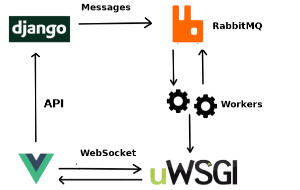

# 项目架构

* 前端框架：`Vue.js`（左下角）
  * 用户在文本框中输入消息，点击发送后消息将通过 API 传到 `Django` .
* 后端框架：`Django`
  * `Django` 收到消息后将消息传递给消息队列 `RabbitMQ`， 该消息随后被`geneRes` （generate response）模块进行分析，用来生成自动回复。
* 消息队列：`RabbitMQ` （主要用来实现多用户通信）
  * `RabbitMQ` 使用 `exchange` 来将消息广播到多个队列中（如图，图中 P 为 `Producer`，X 为 `exchange`）。`Workers` 是进行实际的广播与传递消息的后台进程。
  
  * `RabbitMQ` 是 `Django` 与 `uWSGI` 之间的粘合剂。
* 通信协议：`uWSGI`（`Web Sever Gateway Interface`）（主要用来实时通信）
  * `uWSGI` 主要用来做 `websocket` 的服务器。当客户端建立好连接并确定了他们希望接受消息的通道（`RabbitMQ exchange`）后，立即读取收到的消息并通过 `websocket` 来将消息传给其他用户。